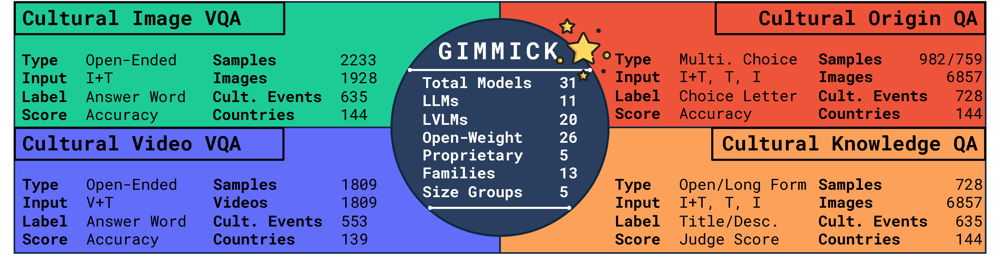

# GIMMICK - Globally Inclusive Multimodal Multitask Cultural Knowledge Benchmarking



# 🚧 Work in Progress 🚧

# News

- **2024-02**: 🤗 We released the datasets introduced by GIMMICK on HuggingFace
- **2024-02**: 📝 We released the first preprint of the [GIMMICK Benchmark paper](https://arxiv.org/pdf/2502.13766).

# Setup the environment

__Tested only on Debian-based machines__

_Note that most models are loaded in FP16 or BF16 and Flash Attention 2. Make sure your GPU supports these features__

1. Install [mamba](https://github.com/conda-forge/miniforge)
2. `mamba env create -f environment.yml`
3. `mamba activate gimmick && pip install flash-attn --no-build-isolation`
4. `src/scripts/check_env.sh`

If the last step was successful, it should print something like this:

```bash
##################### PYTHON ENV 'gimmick' INFO START #####################
Python version: 3.12.8 | packaged by conda-forge | (main, Dec  5 2024, 14:24:40) [GCC 13.3.0]
PyTorch version: 2.5.1
CUDA available: True
CUDA version: 11.8
CUDA devices: 1
Flash Attention 2 Support: True
Transformers version: 4.48.1
##################### PYTHON ENV 'gimmick' INFO END #####################
```


# Evaluate a Model

## Available Models

Run `PYTHONPATH=src python src/gimmick/main.py models` to print the list of supported models.

### Open-Weight VLMs

- **Qwen2 VL 7B** [🤗/qwen/qwen2-vl-7b-instruct](http://hf.co/qwen/qwen2-vl-7b-instruct)
- **Qwen2 VL 72B** [🤗/qwen/qwen2-vl-72b-instruct](http://hf.co/qwen/qwen2-vl-72b-instruct)
- **Phi 3.5 Vision** [🤗/microsoft/phi-3.5-vision-instruct](http://hf.co/microsoft/phi-3.5-vision-instruct)
- **MiniCPM V 2.6** [🤗/openbmb/minicpm-v-2_6](http://hf.co/openbmb/minicpm-v-2_6)
- **Llama 3.2 11B Vision** [🤗/meta-llama/llama-3.2-11b-vision-instruct](http://hf.co/meta-llama/llama-3.2-11b-vision-instruct)
- **InternVL2.5 1B** [🤗/opengvlab/internvl2_5-1b](http://hf.co/opengvlab/internvl2_5-1b)
- **InternVL2.5 2B** [🤗/opengvlab/internvl2_5-2b](http://hf.co/opengvlab/internvl2_5-2b)
- **InternVL2.5 4B** [🤗/opengvlab/internvl2_5-4b](http://hf.co/opengvlab/internvl2_5-4b)
- **InternVL2.5 8B** [🤗/opengvlab/internvl2_5-8b](http://hf.co/opengvlab/internvl2_5-8b)
- **InternVL2.5 26B** [🤗/opengvlab/internvl2_5-26b](http://hf.co/opengvlab/internvl2_5-26b)
- **InternVL2.5 38B** [🤗/opengvlab/internvl2_5-38b](http://hf.co/opengvlab/internvl2_5-38b)
- **InternVL2.5 78B** [🤗/opengvlab/internvl2_5-78b](http://hf.co/opengvlab/internvl2_5-78b)
- **Centurio Aya** [🤗/wuenlp/centurio_aya](http://hf.co/wuenlp/centurio_aya)
- **Centurio Qwen** [🤗/wuenlp/centurio_qwen](http://hf.co/wuenlp/centurio_qwen)

### Open-Weight LLMs

- **Qwen2.5 0.5B** [🤗/qwen/qwen2.5-0.5b-instruct](http://hf.co/qwen/qwen2.5-0.5b-instruct)
- **Qwen2.5 1.5B** [🤗/qwen/qwen2.5-1.5b-instruct](http://hf.co/qwen/qwen2.5-1.5b-instruct)
- **Qwen2.5 3B** [🤗/qwen/qwen2.5-3b-instruct](http://hf.co/qwen/qwen2.5-3b-instruct)
- **Qwen2.5 7B** [🤗/qwen/qwen2.5-7b-instruct](http://hf.co/qwen/qwen2.5-7b-instruct)
- **Qwen2.5 32B** [🤗/qwen/qwen2.5-32b-instruct](http://hf.co/qwen/qwen2.5-32b-instruct)
- **Qwen2.5 72B** [🤗/qwen/qwen2.5-72b-instruct](http://hf.co/qwen/qwen2.5-72b-instruct)
- **InternLM2.5 1.8B** [🤗/internlm/internlm2_5-1_8b-chat](http://hf.co/internlm/internlm2_5-1_8b-chat)
- **InternLM2.5 7B** [🤗/internlm/internlm2_5-7b-chat](http://hf.co/internlm/internlm2_5-7b-chat)
- **InternLM2.5 20B** [🤗/internlm/internlm2_5-20b-chat](http://hf.co/internlm/internlm2_5-20b-chat)
- **Aya Expanse 8B** [🤗/cohereforai/aya-expanse-8b](http://hf.co/cohereforai/aya-expanse-8b)
- **Phi 3.5 Mini** [🤗/microsoft/phi-3.5-mini-instruct](http://hf.co/microsoft/phi-3.5-mini-instruct)

### Proprietary VLMs

- **GPT-4o Mini** [gpt-4o-mini-2024-07-18](https://platform.openai.com/docs/models#gpt-4o-mini)
- **GPT-4o** [gpt-4o-2024-11-20](https://platform.openai.com/docs/models#gpt-4o)
- **Gemini Flash** [gemini-1.5-flash-002](https://ai.google.dev/gemini-api/docs/models/gemini#gemini-1.5-flash)
- **Gemini Pro** [gemini-1.5-pro-002](https://ai.google.dev/gemini-api/docs/models/gemini#gemini-1.5-pro)
- **Claude 3.5 Sonnet** [claude-3-5-sonnet-20241022](https://docs.anthropic.com/en/docs/about-claude/models#model-comparison-table)
